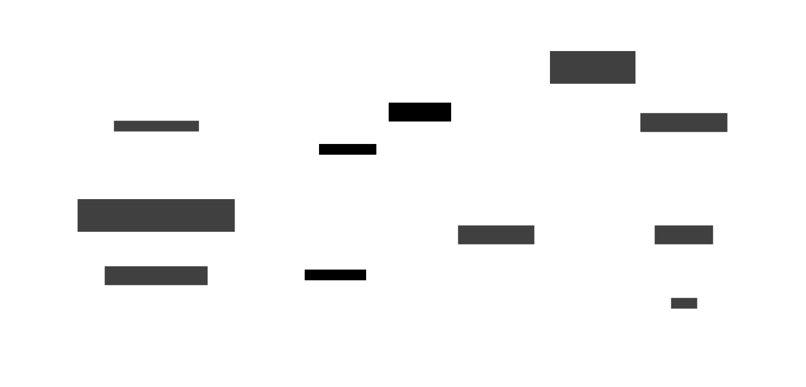

# Architecture

KVitals is a KDE Plasma 6 widget (plasmoid) with a simple two-layer architecture: a **bash data collector** and a **QML UI**.

## Data Flow



## sys-stats.sh

The bash script collects all system metrics and outputs a single JSON object. It is invoked periodically by the QML `DataSource` at the configured update interval.

### Data Sources

| Metric | Source | Method |
|--------|--------|--------|
| CPU | `/proc/stat` | Delta-based calculation between two reads |
| RAM | `/proc/meminfo` | `MemTotal` − `MemAvailable` for used, `MemTotal` for total |
| Temperature | 4-tier fallback | thermal_zone → hwmon → lm-sensors → generic |
| Battery | `/sys/class/power_supply/` | Reads `capacity` and `status` |
| Power | `/sys/class/power_supply/` | `power_now` or `current_now × voltage_now` |
| Network | `/proc/net/dev` | Delta-based RX/TX bytes between two reads |

### Temperature Detection

Temperature detection uses a priority-based fallback:

1. **thermal_zone** — Matches `x86_pkg_temp`, `k10temp`, `zenpower`, `coretemp` labels
2. **hwmon** — Matches `coretemp`, `k10temp`, `zenpower`, `zenergy`, `amdgpu` drivers
3. **lm-sensors** — Parses `Package id 0`, `Tctl`, `Tdie`, `Tccd1`
4. **Generic fallback** — First available thermal zone

!!! note
    The script tries each tier in order and uses the first one that returns valid data. This ensures compatibility with both Intel and AMD systems.

### JSON Output

```json
{
  "cpu": "26",
  "ram_used": "8.8",
  "ram_total": "39.0",
  "temp": "52",
  "bat": "78",
  "bat_icon": "🔋",
  "power": "20.5",
  "power_sign": "+",
  "net_down": "82.2K",
  "net_up": "58.9K"
}
```

## QML UI (main.qml)

The widget has three visual representations:

### Compact Representation (Panel)

A `RowLayout` with a `Repeater` that renders each enabled metric as:
- **Icon** (optional, via `Kirigami.Icon` with `isMask: true`)
- **Label** (optional, e.g., "CPU:")
- **Value** (always shown, e.g., "26%")
- **Separator** (`|` between metrics)

Visibility of icons/labels is controlled by the `displayMode` property.

!!! tip
    Icons use `isMask: true` to render as monochrome, matching the panel's text color regardless of the icon theme.

### Full Representation (Popup)

A `ColumnLayout` with a `Repeater` showing a detailed row per metric with label and bold value, displayed when clicking the widget.

### Tooltip

Multi-line text showing all enabled metrics, displayed on hover.

## Configuration System

```
config/main.xml          ← Config schema (entry names, types, defaults)
config/config.qml        ← Tab registration (General, Metrics, Icons)
ui/configGeneral.qml     ← General tab (display mode, font, interval)
ui/configMetrics.qml     ← Metrics tab (show/hide toggles, network interface)
ui/configIcons.qml       ← Icons tab (per-metric icon picker)
```

All config values are accessed in `main.qml` via `Plasmoid.configuration.<key>`.

!!! tip "Adding New Config"
    When adding a new config entry, you only need to: add it to `main.xml`, create a UI control in the appropriate config tab, and bind it in `main.qml`. No build step needed.

## Project Structure

```
kvitals/
├── metadata.json                   # Plasmoid metadata (name, version, id)
├── install.sh                      # Local install script
├── install-remote.sh               # Remote install (curl/wget)
├── CHANGELOG.md                    # Version history
├── docs/                           # Documentation
│   ├── installation.md
│   ├── configuration.md
│   ├── architecture.md
│   ├── contributing.md
│   └── troubleshooting.md
└── contents/
    ├── config/
    │   ├── config.qml              # Tab registration
    │   └── main.xml                # Config schema
    ├── scripts/
    │   └── sys-stats.sh            # System stats collector
    └── ui/
        ├── main.qml                # Widget UI
        ├── configGeneral.qml       # General settings tab
        ├── configMetrics.qml       # Metrics settings tab
        └── configIcons.qml         # Icons settings tab
```
